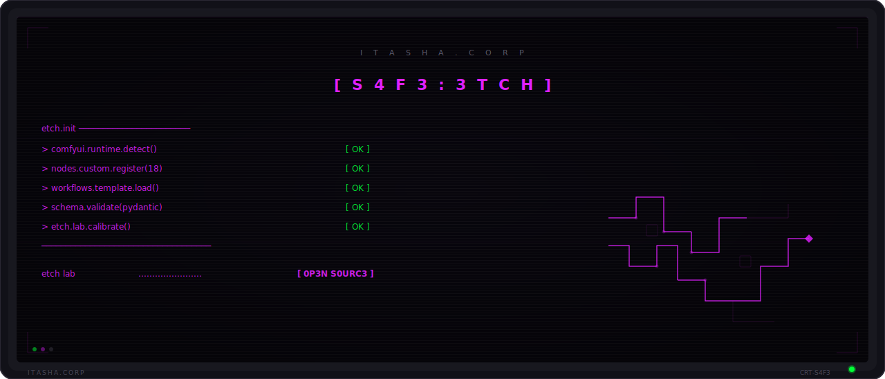

<p align="center">
  <picture>
    <source media="(prefers-color-scheme: dark)" srcset=".github/assets/header.svg" />
    <source media="(prefers-color-scheme: light)" srcset=".github/assets/header.svg" />
    
  </picture>
</p>

<p align="center">
  <strong>Open-source ComfyUI custom nodes. Precision tools for precision work.</strong>
</p>

<p align="center">
  <a href="#what-is-this">About</a> &nbsp;&middot;&nbsp;
  <a href="#installation">Install</a> &nbsp;&middot;&nbsp;
  <a href="#quick-start">Quick Start</a> &nbsp;&middot;&nbsp;
  <a href="#capabilities">Capabilities</a> &nbsp;&middot;&nbsp;
  <a href="#the-network">Network</a> &nbsp;&middot;&nbsp;
  <a href="#contributing">Contributing</a>
</p>

<p align="center">
  
  
  
  
</p>

---

## What is this?

3TCH is a set of ComfyUI custom nodes built for structured, repeatable image generation workflows. It covers authoring, publishing, control, quality, and schema modules — the parts of a production pipeline that need to work the same way every time.

The package includes 18 production workflow templates. Each one has been validated against real workloads. Pydantic handles the data validation. Jinja2 handles the templating. The nodes handle everything in between.

Good tools don't call attention to themselves. They just work when you reach for them.

## Installation

### Option A: Clone into ComfyUI custom nodes

```bash
cd ComfyUI/custom_nodes
git clone https://github.com/46b-ETYKiAL/S4F3-3TCH.git
cd S4F3-3TCH
pip install -r requirements.txt
```

### Option B: pip install

```bash
pip install s4f3-3tch
```

Then restart ComfyUI. The nodes will appear in the node menu under the S4F3 category.

## Quick Start

After installation, the custom nodes are available in ComfyUI's node browser. A basic workflow:

1. Open ComfyUI
2. Search for **S4F3** in the node menu
3. Add an authoring node to your workflow
4. Connect it to your generation pipeline
5. Use a schema node to validate inputs before execution

For production use, start with one of the 18 included workflow templates:

```bash
# Copy a template to your ComfyUI workflows directory
cp templates/production/*.json ~/ComfyUI/user/workflows/
```

```
┌──────────────────────────────────────────┐
│  SYSTEM NOTICE                           │
│  ──────────────────────────────────────  │
│  NODE TYPE : PUBLIC_NODE                 │
│  STATUS    : ACTIVE                      │
│  MODULES   : 5                           │
└──────────────────────────────────────────┘
```

## Capabilities

- **Authoring nodes** — structured content creation with validated inputs
- **Publishing nodes** — output formatting, metadata embedding, and export
- **Control nodes** — workflow branching, conditional execution, and parameter gating
- **Quality nodes** — output validation, consistency checks, and scoring
- **Schema nodes** — Pydantic-based input validation and type enforcement
- **18 workflow templates** — production-ready pipelines for common generation tasks
- **Jinja2 templating** — dynamic prompt construction with variable substitution

<details>
<summary><strong>Technical Context</strong></summary>

3TCH nodes are organized into five modules, each covering a distinct phase of the image generation pipeline. The authoring module handles prompt construction and parameter setup. Publishing manages output formatting and delivery. Control provides workflow logic. Quality validates results. Schema enforces data contracts.

All node inputs are validated through Pydantic models before execution. This catches configuration errors at the node level rather than mid-pipeline. Jinja2 templates allow dynamic prompt construction with variables, conditionals, and loops.

The 18 workflow templates represent tested production configurations covering portrait generation, batch processing, style transfer, upscaling pipelines, and multi-pass refinement workflows.

</details>

## The Network

| Node | Role |
|------|------|
| [S4F3-R0UT3-4RB1T3R](https://github.com/46b-ETYKiAL/S4F3-R0UT3-4RB1T3R) | Central orchestration |
| [S4F3-R3L4Y](https://github.com/46b-ETYKiAL/S4F3-R3L4Y) | MCP server infrastructure |

## Tech Stack

| Layer | Technology |
|-------|------------|
| Platform | ComfyUI |
| Language | Python |
| Validation | Pydantic |
| Templating | Jinja2 |
| License | Apache 2.0 |

## Status


> [!TIP]
> This project is open source under the Apache 2.0 license. Contributions welcome.

## Contributing

Contributions are welcome. Please read [CONTRIBUTING.md](CONTRIBUTING.md) for guidelines on submitting issues, feature requests, and pull requests.

## License

Licensed under the Apache License, Version 2.0. See [LICENSE](LICENSE) for the full text.

```
Copyright 2026 Itasha Corp

Licensed under the Apache License, Version 2.0 (the "License");
you may not use this file except in compliance with the License.
You may obtain a copy of the License at

    http://www.apache.org/licenses/LICENSE-2.0

Unless required by applicable law or agreed to in writing, software
distributed under the License is distributed on an "AS IS" BASIS,
WITHOUT WARRANTIES OR CONDITIONS OF ANY KIND, either express or implied.
See the License for the specific language governing permissions and
limitations under the License.
```

<p align="center">
  <picture>
    <source media="(prefers-color-scheme: dark)" srcset=".github/assets/footer.svg" />
    <source media="(prefers-color-scheme: light)" srcset=".github/assets/footer.svg" />
    
  </picture>
</p>
